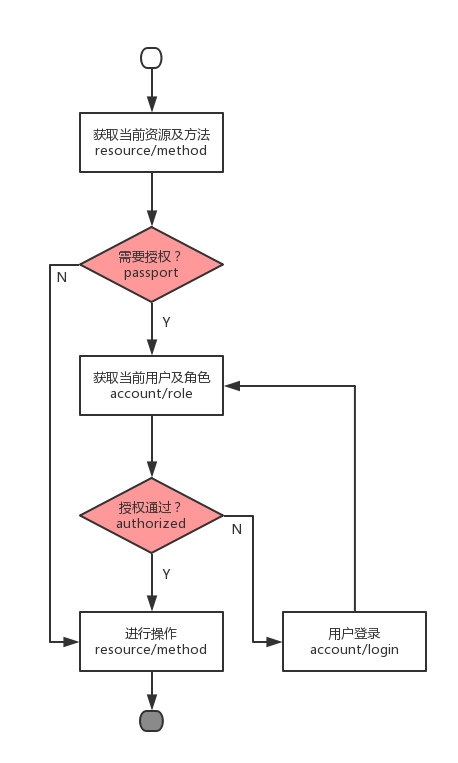
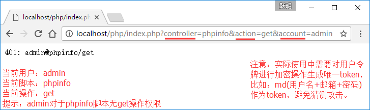

简单权限控制实现
================

### 说明
- 这仅仅一个构思而已，力求简单，方便解释
- 使用经典PHP语句switch...case..实现简单RBAC
- 实际应用中最好使用class->method()
- request中应是加密过的token，明文则形同虚设

### 流程


### 实现


### 代码
- 配置：config/rbac.php

```php
<?php
return array(
  array(
    'account' => 'admin',
    'role' => 'admin',
    'authorized' => array(
      'index/index',
      'index/get',
      'pdo/index',
      'phpinfo/index'
    )
  ),
  array(
    'account' => 'user',
    'role' => 'user',
    'authorized' => array(
      'index/index',
      'index/get'
    )
  ),
  array(
    'account' => 'guest',
    'role' => 'guest',
    'authorized' => array(
    )
  )
);
```

- 入口：index.php

```php
<?php
defined('RBAC') || define('RBAC', true);

$controller = 'index';
if(isset($_REQUEST['controller'])) {
  $controller = $_REQUEST['controller'];
}

$action = 'index';
if(isset($_REQUEST['action'])) {
  $action = $_REQUEST['action'];
}

$rbac = require_once('./config/rbac.php');

$account = 'guest';
//取角色
if(isset($_REQUEST['account'])) {
  $account = $_REQUEST['account'];
  $index = 0;
  foreach ($rbac as $key => $value) {
    if($value['account'] == $account) {
      $current = $index;
    }
    $index++;
  }
}
//当前操作
if(isset($current)) {
  $ca = $controller . '/' . $action;
  if(in_array($ca, $rbac[$current]['authorized'])) {
    $controller_file = './controller/'. $controller . '.php';
    if(file_exists($controller_file)) {
      require_once($controller_file);
    } else { 
      die('404: '. $controller_file);
    }
  } else {
    die('401: ' . $account . '@' . $ca);
  }
} else {
  die('403');
}
```

- 脚本：controller/index.php

```php
<?php
defined('RBAC') || die(401.3);
$action = 'index';

if(isset($_REQUEST['action'])) {
  $action = $_REQUEST['action'];
}

switch ($action) {
  case 'get':
    $res = 'get';
    break;
  
  default:
    $res = 'index';
    break;
}

echo $res;
```

> 方跃明